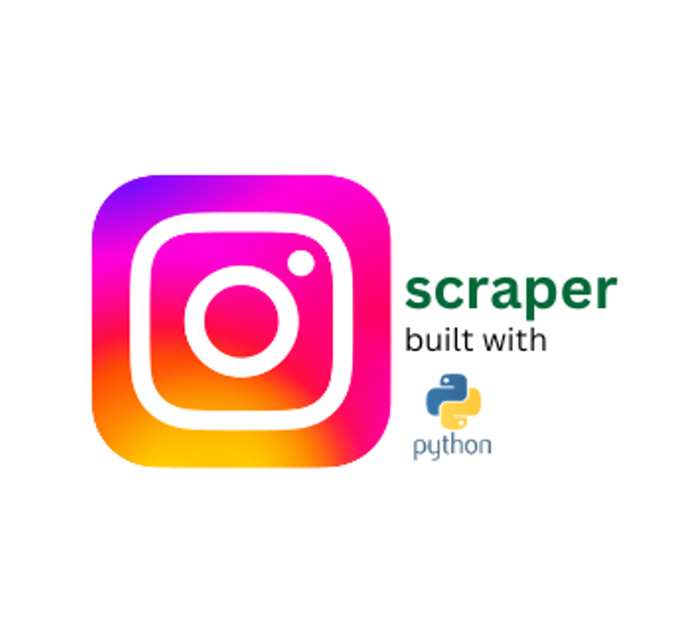

<!-- PROJECT SHIELDS -->
<!--
*** I'm using markdown "reference style" links for readability.
*** Reference links are enclosed in brackets [ ] instead of parentheses ( ).
*** See the bottom of this document for the declaration of the reference variables
*** for contributors-url, forks-url, etc. This is an optional, concise syntax you may use.
*** https://www.markdownguide.org/basic-syntax/#reference-style-links
-->

<!-- PROJECT LOGO -->
 

<h2 align="center">instagram-scraper</h2>

  

    Python-based Instagram's data scraping scripts
     
     

<!-- ABOUT THE PROJECT -->
## About The Project

This script is designed for scraping data from Instagram public profiles using the [Instagrapi](https://github.com/subzeroid/instagrapi) module.

The Instagrapi Python module only handles the API requests, so I've added additional features to ensure its functionality:
- Parsing and storing the scraped data in JSON format
- Setting a proxy (I used [ScrapeOps](https://scrapeops.io/) service, but you can use any proxy that works)
- Log recordings to track the process and identify bugs
- Capability to resume unfinished scraping processes
- Optional: Use the [data_cleanse.py](data_cleanse.py) script for parsing JSON into a CSV file in Excel-friendly data format

For a scraping demo, please visit the [`Medium Story: How to Scrape and Analyze Instagram Influencer Engagements`](https://medium.com/@musayohanes00/how-to-scrape-and-analyze-instagram-influencer-engagements-ae01197c652b).

(<a href="#readme-top">back to top</a>)

### Built With

[![Python][Python.py]][Python-url] 

(<a href="#readme-top">back to top</a>)

<!-- LICENSE -->
## License

Distributed under the MIT License. See [`LICENSE.txt`](LICENSE.txt) for more information.

(<a href="#readme-top">back to top</a>)

<!-- CONTACT -->
## Contact

Musa Yohanes - musayohanes00@gmail.com

Project Link: [https://github.com/Muyoouu/instagram-scraper](https://github.com/Muyoouu/instagram-scraper)

(<a href="#readme-top">back to top</a>)

<!-- MARKDOWN LINKS & IMAGES -->
<!-- https://www.markdownguide.org/basic-syntax/#reference-style-links -->
[Python.py]: https://img.shields.io/badge/python-3670A0?style=for-the-badge&logo=python&logoColor=ffdd54
[Python-url]: https://www.python.org/